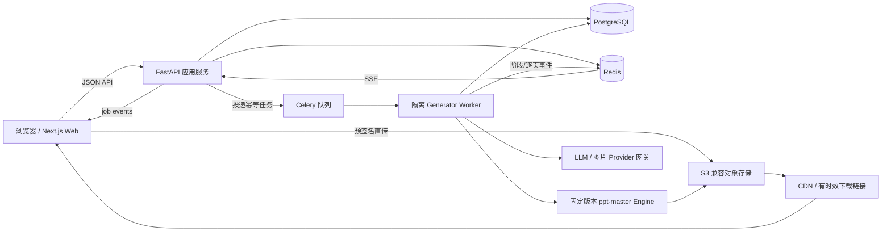

# 即刻AI-PPT：技术方案（评审稿）

> 文档定位：历史评审输入（非规范）。实施范围、API、状态机、幂等与 Goal 顺序以根目录 [SPEC.md](../../SPEC.md) 和 [PLAN.md](../../PLAN.md) 为准。  
> 调研日期：2026-08-15  
> 上游基线：`hugohe3/ppt-master` `v4.7.0`；开发评估参考 `main@a9850e57ec05bacff409cd213bb027e1a03117f8`

## 1. 结论先行

本项目不应把 `ppt-master` 当作“已有网站”二次装修。它的真实形态是 Agent 工作流规范与 Python 本地生成工具链，强项是文档解析、canonical SVG 中间表示、质量检查、SVG→DrawingML/PPTX 原生对象编译、PPTX 模板填充与增强；它没有多用户 API、数据库、队列、对象存储、权限、计费或生产级 Web 编辑器。

推荐架构是：

- 用独立的 Web 产品层承接用户、草稿、大纲、模板、历史与编辑体验；
- 将固定版本的 `skills/ppt-master/` 原样封装进隔离 Python Worker；
- 用结构化 JSON 合同把“意图 → 大纲 → 页面计划 → 生成工件”串起来；
- 用持久化任务状态与 SSE 展示逐页进度，刷新或离开页面不终止任务；
- MVP 只承诺“主题/文档 → 可编辑大纲 → 模板/模式 → 原生可编辑 PPTX → 历史/导出”，暂不做 PowerPoint 级全功能画布。

这是对 WPS 交互骨架的借鉴，不复制 WPS 品牌、标识或高度近似视觉外观。

## 2. 产品调研结论

### 2.1 已证实的 WPS 产品链路

Firecrawl 对当前独立站、官方社区、WPS 官网文章和 2026 年公开报道进行了交叉检索。可稳定归纳的主链路是：

`主题/文档输入 → AI 意图澄清 → 可对话修改大纲 → 选择模式与模板 → 逐页生成预览 → 保存并进入编辑 → 导出/历史创作`

关键事实：

- 当前入口同时承接主题与文档，首页还有文档转 PPT、美化 PPT、图片转可编辑 PPT、模板与上传模板等入口。[WPS AIPPT 独立站](https://aippt.wps.cn/)
- 新版先询问制作目标、受众和重点，再输出大纲；大纲支持边聊边改，确认后才正式生成。[WPS 官方社区教程](https://bbs.wps.cn/topic/88163)、[新华网报道](http://www.xinhuanet.com/finance/20260609/98d531e193c546a292b6a51fab32ff91/c.html)
- 专业模式强调动态布局与复杂图表；公开报道提到兼容 1000 套全文模板、上传参考图以及 5–8 分钟级专业模式生成时间。时间是宣传/案例指标，不作为本项目 SLA。[新华网报道](http://www.xinhuanet.com/finance/20260609/98d531e193c546a292b6a51fab32ff91/c.html)
- 生成结果仍需逐页核验内容、数据、图表和图片；AI 结果应被视为可编辑初稿。[WPS 官方核验指南](https://www.wps.cn/article/wps-ai-generate-ppt-tutorial-guide.html)
- 免费额度与会员权益会变化，公开材料不能支持稳定的具体定价结论；本项目只预留能力点与配额模型，不照抄会员规则。[WPS 365 文章](https://plus.wps.cn/blog/p106786.html)

### 2.2 从参考图提炼的设计原则

- 保留：一个主输入、生成前可审核大纲、对话与结构化结果并置、逐页生成、上传模板预检。
- 优化：首页 CTA 改为“生成大纲”；意图是可编辑表单而非只藏在聊天里；大纲支持增删、排序、撤销；长任务只保留一个取消入口；上传模板必须展示版式角色与兼容性。
- 长任务状态必须覆盖：排队、运行、质量检查、部分成功、失败重试、取消请求、已取消、完成；页面级状态独立保存。
- 桌面为 70/30 工作台；小于 1200px 助手改抽屉；小于 768px 单栏或页签。

## 3. MVP 边界

### 3.1 必做

1. 登录与个人工作区；草稿自动保存、历史恢复。
2. 主题输入、DOCX/PDF/PPTX/HTML 上传；安全校验和解析状态。
3. 创作意图：目标、受众、页数、语言、内容深度、配图偏好、补充要求。
4. 版本化大纲：编辑标题/要点、增删页、排序、单页重写、撤销、批准。
5. 三种可解释模式：
   - 原生专业：优先 canonical SVG → DrawingML，追求可编辑对象与稳定排版。
   - 视觉创意：允许生成图增强；必须明确哪些页面或素材会图片化。
   - 模板复用：用户 PPTX 模板分析、版式角色映射与原生填充。
6. 逐页生成进度、质量检查、取消、失败页重试、刷新恢复。
7. 结果预览、页面排序/删除、文本快速修改、单页重生成、PPTX 导出。
8. 模板中心与自定义模板上传；MVP 先做私有模板，不做公开交易市场。

### 3.2 暂缓

- 任意旧 PPT 一键美化、截图/PDF 完整反向还原为可编辑图层；
- PowerPoint 级自由画布、多人实时协作、评论和复杂版本合并；
- 云盘生态、企业组织模板治理、公开模板交易；
- 完整会员商品体系；先用 `entitlement + quota` 能力点占位；
- EPUB 输入，直至许可证与解析实现完成评审。

## 4. 总体架构



### 4.1 推荐技术栈

| 层 | 推荐 | 选择理由 |
|---|---|---|
| Web | Next.js 16.2.x App Router + React + TypeScript | 页面、服务端渲染和 BFF 能力成熟；Route Handlers 使用 Web Request/Response API，可处理 `formData()` 与流式 Response。[Next.js Route Handler / Streaming 文档](https://github.com/vercel/next.js/blob/v16.2.9/docs/01-app/03-api-reference/03-file-conventions/route.mdx) |
| API | FastAPI + Pydantic | 与上游 Python 工具链同语言；`UploadFile` 使用 spooled file，适合大文件元数据与流式处理；`StreamingResponse` 可承载 SSE。[FastAPI UploadFile](https://fastapi.tiangolo.com/tutorial/request-files/)、[StreamingResponse](https://fastapi.tiangolo.com/advanced/custom-response/) |
| 队列 | Celery + Redis（MVP） | Python 生态成熟，支持重试、自定义进度状态与多队列隔离；长任务必须幂等，启用 late ack 时才能安全恢复。[Celery Tasks](https://docs.celeryq.dev/en/stable/userguide/tasks.html)、[Celery Optimizing](https://docs.celeryq.dev/en/stable/userguide/optimizing.html) |
| 主库 | PostgreSQL | 版本化大纲、任务、模板、工件和用量台账需要事务与可查询历史。 |
| 文件 | S3 兼容对象存储 | 上传源文件、预览图、SVG、PPTX、质量报告与日志不能落在 Web/API 本地盘。 |
| 观测 | OpenTelemetry + error tracking + 指标/日志 | 统一关联 `request_id / draft_id / job_id / slide_id / provider_call_id`。 |

Next.js 只承担 Web/BFF，不执行 PPT 生成。FastAPI 不用 `BackgroundTasks` 承担 5–15 分钟任务，所有生成进入队列。

### 4.2 代码与部署边界

```text
apps/
  web/                 # Next.js 产品 UI
services/
  api/                 # FastAPI，鉴权、草稿、模板、任务、SSE
  worker/              # Celery tasks、沙箱、Provider gateway
packages/
  contracts/           # JSON Schema / OpenAPI 派生类型
vendor/
  ppt-master/          # 固定 tag/commit，尽量不改身份与许可证文件
infra/
  compose/             # 本地开发
  deploy/              # 生产部署清单
```

`ppt-master` 应独立打包成 Worker 镜像或镜像层。Web/API 镜像不携带 LibreOffice、字体、解析器和生成依赖，降低攻击面与发布耦合。

## 5. `ppt-master` 复用映射

上游定位与工件流以其 [Technical Design](https://github.com/hugohe3/ppt-master/blob/a9850e57ec05bacff409cd213bb027e1a03117f8/docs/technical-design.md) 为准。

| 产品能力 | 上游复用 | 封装方式 | 缺口 |
|---|---|---|---|
| 文档解析 | `scripts/source_to_md/` | Worker 子进程，输出 Markdown、图片清单、conversion profile | MIME/病毒/压缩炸弹/租户隔离 |
| 方案确认 | `confirm_ui` schema、catalog | 抽取 JSON 合同；UI 重写 | 版本、权限、并发修改、审计 |
| 原生专业生成 | canonical SVG、`svg_quality/`、`svg_to_pptx/` | 每页作为幂等子任务；质量报告入库 | 服务化编排、进度事件、恢复 |
| 模板上传 | `pptx_to_svg/`、`pptx_template_import.py` | 分析 Worker，生成页面角色候选与预览 | 映射 UI、版权、模板版本 |
| 原生模板填充 | `template_fill_pptx/` | 独立生成路由 | 网站级字段映射与失败回退 |
| PPTX 增强 | `native_enhance_pptx_core.py` | 后续能力 | 非 MVP |
| 图片/TTS | Provider adapters | 统一 Provider 网关、配额与审计 | 条款、成本、内容安全 |
| 本地 Flask UI | 不直接复用 | 只参考交互/数据契约 | 无公网鉴权、多租户与 CSRF 设计 |

生产固定 `v4.7.0` 或审计 commit；不得运行时拉取浮动 `main`。构建时生成依赖锁、SBOM 与镜像签名。

## 6. 生成工作流

### 6.1 结构化合同

核心对象都版本化，LLM 只通过 schema 产出，不直接拼接数据库或文件系统命令：

```text
SourcePackage
  → IntentSpec vN
  → OutlineSpec vN
  → ThemeSpec / TemplateBinding
  → DeckPlan
  → SlidePlan[]
  → canonical SVG + sidecars
  → QA report
  → native PPTX + previews
```

大纲批准后记录不可变 `generation_snapshot_id`。用户继续修改大纲会产生新版本，不悄悄改变已运行任务。

### 6.2 任务拆分

1. `source.intake`：校验、杀毒、归档。
2. `source.parse`：文档转 Markdown/素材清单。
3. `intent.infer`：生成结构化意图与待确认问题。
4. `outline.generate`：故事线与逐页大纲。
5. `template.analyze`：版式角色、字体、配色、资产与兼容性。
6. `deck.plan`：固定输入快照并生成页面计划。
7. `slide.render[n]`：逐页生成 canonical SVG。
8. `slide.qa[n]`：尺寸、溢出、字体、图片、对比度与合同检查。
9. `deck.compile`：SVG→DrawingML/PPTX。
10. `deck.package_qa`：包结构、页数、关系、可打开性与预览回归。
11. `artifact.publish`：持久化并签发有时效下载链接。

### 6.3 状态机

```text
draft
  → source_uploading → source_parsing → intent_review
  → outline_generating → outline_review → outline_approved
  → theme_ready → queued → generating → qa
  → completed | partial | failed | cancelled
  → result_review → export_running → export_ready
```

每页：

```text
pending → content_generating → rendering → qa → ready
                                   └→ failed → retrying ─┘
```

取消采用 `running → cancel_requested → cancelled`。前端只发送请求，Worker 在页与阶段边界检查取消标记；Celery `revoke(terminate=True)` 仅作为失控任务兜底，因为强杀可能留下半成品。

### 6.4 幂等与恢复

- 每个任务键：`tenant_id + generation_snapshot_id + stage + slide_index + attempt`。
- 输出先写临时对象，校验通过后原子发布 manifest；重试不覆盖已确认工件。
- Celery 使用指数退避；可重试错误与用户输入错误分开。
- `task_acks_late = True` 时任务必须幂等，Worker 一次只预取有限长任务。
- Redis 只做队列、短期状态和发布订阅；业务真相与最终进度写 PostgreSQL。
- SSE 断线后用 `Last-Event-ID` 补发；前端先拉 job snapshot，再订阅增量事件。

## 7. 数据模型

最小核心表：

- `users`, `organizations`, `memberships`
- `drafts`, `sources`, `source_artifacts`
- `intent_versions`, `outline_versions`, `outline_slides`
- `templates`, `template_versions`, `template_layouts`
- `generation_snapshots`, `generation_jobs`, `job_events`
- `slides`, `slide_versions`, `artifacts`, `exports`
- `entitlements`, `usage_ledger`
- `provider_calls`, `audit_logs`

重要约束：

- 所有租户数据带 `organization_id`；对象存储 key 同样分租户前缀。
- `outline_versions`、`template_versions`、`generation_snapshots` 不可变。
- 文件表只存对象 key、hash、MIME、大小、保留期和扫描结果，不存永久公开 URL。
- `usage_ledger` 记录页数、模型 token、图片次数、Worker 秒数和导出次数，便于成本与配额核算。

## 8. API 草案

```text
POST   /v1/drafts
POST   /v1/uploads:presign
POST   /v1/drafts/{draftId}/sources
GET    /v1/drafts/{draftId}
POST   /v1/drafts/{draftId}/intent:infer
PUT    /v1/drafts/{draftId}/intent
POST   /v1/drafts/{draftId}/outline:generate
PUT    /v1/drafts/{draftId}/outline
POST   /v1/drafts/{draftId}/outline:approve
GET    /v1/templates
POST   /v1/templates:analyze
PUT    /v1/templates/{templateId}/layouts
POST   /v1/drafts/{draftId}/generations
GET    /v1/jobs/{jobId}
GET    /v1/jobs/{jobId}/events            # SSE
POST   /v1/jobs/{jobId}:cancel
POST   /v1/presentations/{id}/slides/{n}:retry
POST   /v1/presentations/{id}/exports
GET    /v1/history
```

写接口要求 `Idempotency-Key`；资源更新带版本号或 ETag，避免大纲双写覆盖。

## 9. 安全、隐私与运维门禁

### 9.1 上传与沙箱

- 浏览器直传对象存储；API 只签名和收尾，避免大文件穿过 Web 实例。
- 扩展名、MIME 与 magic bytes 三重校验；限制文件、页数、解压后体积和素材数。
- 杀毒、ZIP bomb、防路径穿越；Office/PDF/HTML/URL 解析运行在非 root、只读根文件系统、限 CPU/内存/磁盘/时间的 Worker。
- URL 抓取做 SSRF 防护：阻断内网、云 metadata、重定向绕过和任意协议；出站经代理白名单。
- Provider 密钥只在网关；不写入 prompt、日志、工件或前端。

### 9.2 数据治理

- 明示上传资料会流向哪些 LLM/图片 Provider；企业租户可选不外发或指定区域。
- 源文件、临时工件、聊天与日志分别配置保留期；支持项目级删除和导出。
- 下载 URL 短时有效；敏感预览不走公共 CDN 缓存。
- 用户模板和网页图片保留来源、许可证、署名与使用范围。

### 9.3 质量与兼容

- 建立固定金样本：中英文、长标题、表格、图表、公式、不同字体、用户模板。
- 每次引擎升级跑 SVG 视觉差异、PPTX 包结构、PowerPoint 打开与 WPS 实机截图回归。
- 关键 SLA 分开：排队延迟、首个大纲、首张预览、整套生成、导出；不承诺单一“5 分钟”。

## 10. 许可证与知识产权（上线前必须完成）

这部分是工程风险提示，不是法律意见。

1. `ppt-master` 本体是 [MIT License](https://github.com/hugohe3/ppt-master/blob/a9850e57ec05bacff409cd213bb027e1a03117f8/LICENSE)，商业使用可行，但复制或 substantial portions 必须保留版权与许可文本。
2. 上游 `attribution_guard.py` 会检查官方元数据、LICENSE、SPONSORS 与入口 gate。建议完整保留 vendor 子树，在外层独立品牌化与服务化。[attribution_guard.py](https://github.com/hugohe3/ppt-master/blob/a9850e57ec05bacff409cd213bb027e1a03117f8/skills/ppt-master/scripts/attribution_guard.py)
3. PyMuPDF 为 AGPLv3/商业双许可；专有 SaaS 上线前必须由法务确认开源义务、采购商业许可或替换解析栈。[PyMuPDF 官方许可说明](https://github.com/pymupdf/pymupdf/blob/main/docs/about.rst)
4. EbookLib 明确为 AGPLv3。MVP 建议先禁用 EPUB，之后评估替换或合规方案。[EbookLib License](https://github.com/aerkalov/ebooklib/blob/master/README.md#license)
5. 图标、字体、网图、AI 图片、TTS 与模板各自有许可和商标风险；第三方图标声明中含 CC BY 4.0 与品牌图标注意事项。[上游第三方声明](https://github.com/hugohe3/ppt-master/blob/a9850e57ec05bacff409cd213bb027e1a03117f8/skills/ppt-master/templates/icons/THIRD_PARTY_NOTICES.md)
6. 不复制 WPS 名称、Logo、会员文案或高度近似 trade dress。产品采用独立“即刻AI-PPT”代号，仅借鉴通用工作流。

## 11. 分阶段交付

### P0：引擎与合规 Spike

- 固定上游版本、生成依赖 lock、SBOM；
- 完成 PDF/EPUB 许可决策；
- 用 10 份金样本文档验证解析 → SVG → PPTX；
- 验证 Worker 沙箱、字体和 PowerPoint/WPS 兼容基线。

**退出条件**：法务与技术都确认可上线的解析依赖；PPTX 可编辑性与打开成功率达到约定门槛。

### P1：闭环 MVP

- 登录、上传、草稿、意图、大纲、模板选择；
- 原生专业模式；逐页进度、取消、重试；
- 预览、简单结果调整、PPTX 导出、历史。

**退出条件**：刷新可恢复、失败页可单独重试、同一快照重试结果可追踪、跨租户不可访问。

### P2：体验增强

- 视觉创意模式、用户模板分析与版式映射；
- 单页对话修改、版本对比、成本/配额；
- PDF/图片导出、更多 Provider 与企业隐私选项。

### P3：协作与商业化

- 组织模板、多人评论/协作、品牌系统；
- 公开模板中心、审核与版权流程；
- 正式商品、账单、运营和企业管理。

## 12. 本轮需确认的决策

1. MVP 是否按“主题/文档生成 + 原生可编辑 PPTX”聚焦，暂缓美化旧 PPT 与截图转可编辑 PPT？
2. 是否接受“双服务 + Worker”架构：Next.js Web、FastAPI API、Celery 生成 Worker？
3. 是否将 `ppt-master` 固定版本原样 vendor，在外层封装，而不是直接大改上游核心？
4. PDF 解析走“购买 PyMuPDF 商业许可”还是“优先替换宽松许可证解析栈”；EPUB 是否先下线？
5. 产品代号“即刻AI-PPT”是否作为正式品牌名沿用，主色是否继续采用当前钴蓝方案？

确认这些决策后，才进入项目脚手架、API 合同和 Worker 适配代码。
