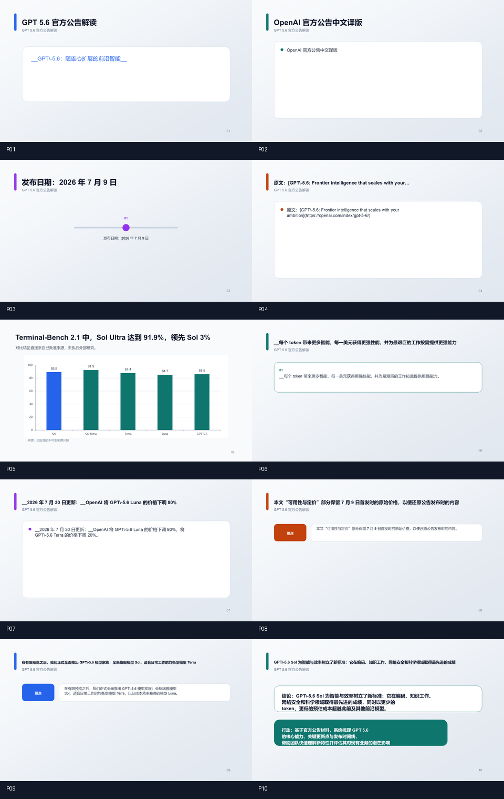
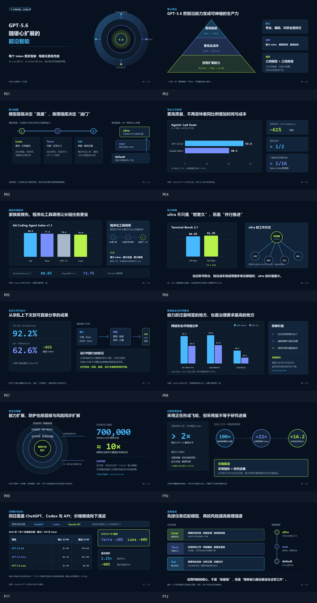

# ISSUE-003 阶段 0 基线

本目录冻结 ISSUE-003 改造前的两类质量基线和一份用户下载副本。主比较对象是 `before-deterministic-template.pptx` 与后续使用相同批准 snapshot 生成的 Agent 候选；`reference-ppt-master.pptx` 只作为质量参考，不表述为严格 A/B。

## 冻结工件

| 工件 | 身份 | 页数 | 递归 Shape | 可见字符 | 备注页 | SHA-256 |
| --- | --- | ---: | ---: | ---: | ---: | --- |
| `before-deterministic-template.pptx` | 网站 `default-agentic` 的 canonical before；实际作者为固定 Python 模板 | 10 | 81 | 1,168 | 0 | `4fa9901f9c4a38c2d41fd98e60cd65c56999caa4050be4c8f37cb73aeba4fe6e` |
| `before-user-download.pptx` | 同一 10 页结果的用户下载谱系副本；视觉内容相同，ZIP 字节不同 | 10 | 81 | 1,168 | 0 | `9a9460860a9703003cb7de63f6106d04b4361c0b900a87b76873ba39fa7012ea` |
| `reference-ppt-master.pptx` | `ppt-master` 单主 Agent + Skill 参考结果 | 12 | 450 | 2,903 | 12 | `5e22b233e95ff995096239a4ffc1834d6566881ca83994353495cfff5283dbb5` |

递归 Shape 包含 group 内部对象；`baseline-metrics.json` 同时保留 top-level Shape、逐页文本、图片、图表、表格、Master、实际使用 Layout 和媒体部件统计。它与 ISSUE 文档中的 PowerPoint/OOXML 统计口径略有差异，因此不能把 Shape 数作为独立质量评分。

## Before 的可重复输入

- 生产任务：`01M0KZ2JRRW8PJKER5KVVXFTMF`
- 批准 snapshot：`01M0KZ2JRMZHFH5CG2RQTBRDC3`
- snapshot SHA-256：`fdb0cd6f714baf0e5af838617de3519f1295e8565e764c6f61a678544f4d4ffe`
- 页数与 stable roster：`before-approved-snapshot.json` 中冻结的 10 页批准 Outline
- 批准来源：`before-approved-source.md`，SHA-256 `811333418f1cf5b69330c0812781a82fa89467a403049c51e211653656ee04cf`
- 转换配置：`before-conversion-profile.json`，SHA-256 `4818925561b4732a3f0ed7bca05791b789c59a6b27d8dc4a98c8ab31ed0fb857`
- 运行版本：`ppt-master@v4.7.0+e8323bfa`、`approved-outline-to-deck-plan@1`、`instant-ppt-default@v2.0.0`、`instant-ppt-runtime@v2`、`kimi-k3+image-disabled@2`
- 图片策略：`none`；closed-corpus；10 页顺序和 stable ID 不得被候选结果改写。

这些数据从本地 PostgreSQL 与私有 MinIO 恢复，并由 `freeze_baseline_inputs.ps1` 对对象 hash 逐一 fail-closed 校验。后续候选必须以该 snapshot 与来源为权威；若模型、prompt、runtime 或 reference 版本变化，必须在候选 manifest 中明确记录。

## PowerPoint 渲染和人工盘点

PowerPoint COM 已把三份工件逐页导出为 1280×720 PNG，三份均可打开、页数匹配且 Repairs 集合为 0；应用版本记录在 `powerpoint-render-evidence.json`。





人工盘点结论：before 虽能打开且无明显越界，但多页退化为“标题 + 单一白色正文面板”，信息密度、关系表达和页面节奏明显不足；reference 按页选择环形图、金字塔、对比图、流程、表格、时间/决策结构，层级和信息密度明显更好。此记录是改造前观察，不是改造后验收；最终必须用冻结 before 输入重新生成并再次做“更好/基本相同/更差”比较。

## 重现命令

```powershell
powershell -NoProfile -ExecutionPolicy Bypass -File scripts/issue003/freeze_baseline_inputs.ps1
powershell -NoProfile -ExecutionPolicy Bypass -File scripts/issue003/render_baselines.ps1
python -m uv run --package instant-ppt-worker python scripts/issue003/analyze_baselines.py docs/evidence/issue003/baseline
```

第一条命令依赖当前本地阶段 0 数据库与 MinIO；本目录中的冻结副本使后续比较不再依赖这些外部行或保留期。
